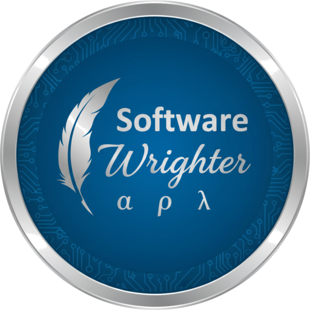

<p align="center">
  
</p>

# sw-apl

A clean-room APL\360 interpreter written in Rust, from scratch.

sw-apl brings back classic IBM APL the way it was used on a
terminal: traditional glyphs typed as Unicode, the six-space
indent prompt, printer-style transcript output, the del editor
for defining functions, and the APL\360 system commands for
workspaces (`)CLEAR`, `)WSID`, `)SAVE`, `)LOAD`, `)FNS`,
`)VARS`, ...). It is a command-line program for macOS and Linux;
a browser version built with Yew and WebAssembly follows.

It is deliberately pure APL\360: not APLSV (no quad-named system
variables, no execute or format; I-beams instead), not APL2, not
Dyalog (flat arrays only, no nested arrays, no each). It is also
not a port. The C interpreter
`sw-cor24-apl` and GNU APL served only as references for expected
behaviour and for the conformance corpus in `samples/`.

## A session

<p align="center">
  
</p>

Recorded with [vhs](https://github.com/charmbracelet/vhs) from
`docs/tapes/mvp.tape` (`just tape` re-renders it).

## Status

Every APL\360 primitive and operator now works on arrays of any
rank: the scalar functions (arithmetic, comparison, boolean,
circular, factorial and binomial, roll), the mixed functions
(iota, rho, ravel, catenate and laminate, take, drop, reverse,
rotate, transpose, compress, expand, membership, index-of, grade,
encode, decode, deal), the operators (reduce and scan on any axis,
inner and outer products), bracket indexing and indexed
assignment, character data, mixed output, and quad output. Display
follows the APL\360 rules, including `)WIDTH` wrapping and
higher-rank planes, and errors print with the caret. `)ORIGIN`,
`)DIGITS`, and `)WIDTH` reply `WAS n`.

Functions are defined the APL\360 way: an opening del and a header
(`NAME`, `NAME B`, `A NAME B`, each with or without `R left-arrow`),
body lines typed behind the `[n]` prompt, a closing del. Names after
semicolons are local for the length of the call, arguments bind into
a fresh frame, and the result is whatever the header's result
variable holds at exit.

Labels are local constants holding their line number, and the right
arrow branches: the first element of its value selects the next line,
an empty vector falls through, and zero or a line the function does
not have exits. That is the whole of APL\360 control flow, and it is
enough for the conditional branch (label times iota of the condition,
which is empty when the condition is false). The horse race in
`samples/50-horse-race.apl` runs, and Conway's Life runs as a pair of
functions in `samples/54-life-function.apl`.

Functions are edited the APL\360 way, in definition mode: a bracketed
number moves to a line or replaces it, a bracketed quad displays,
delta deletes, a fractional number inserts between two existing lines
(the close renumbers from 1), and `[0]` edits the header. Del-tilde
closes a definition locked.

A line that fails inside a function suspends it rather than unwinding
it: the error names the function and the line, the locals stay there
to look at, `)SI` and `)SIV` show where everything stopped, a bare
right arrow clears the top entry, and a right arrow with a line number
takes the function up again.

A statement can read a line as it runs: quad prompts and evaluates
what is typed, quote-quad takes the characters as they are, and a
prompt written with quote-quad shares a line with its answer. In
batch the lines come from the script.

The I-beam system functions report the time of day, the processor
time used, the space still free, the terminals connected, the sign-on
time, the date, the line now executing, and the state indicator.

A `.apl` file can be executable: a leading `#!` line belongs to the
shell, so sw-apl drops it and the transcript begins with the program.
`)OFF` signs off the APL\360 way, with the time, the connect time and
the processor time. Ctrl-C stops a running function: it reports
INTERRUPT, names the line it stopped on, and leaves the function
suspended for `)SI` to show and a branch to take up again.

Workspaces save and load: `)SAVE` writes a plain UTF-8 file that is
APL you could have typed, `)LOAD` reads it back by running it, and
`)COPY` takes names out of one without taking its settings.

A workspace holds a fixed number of bytes, which `--ws-size` sets and
I-beam 22 reports what is left of. Anything that will not fit -- an
assignment, a definition, the arguments a call binds, a `)LOAD` or a
`)COPY` -- is WS FULL, and the workspace is left exactly as it was.

Not there yet: `)FNS` and the other inquiry commands, the shipped
library workspaces, and domino. A
glyph from a later APL is a CHARACTER ERROR that names it, so the
Dyalog Life one-liner answers "dfn brace, not APL\360". See the
parity checklist for the row-by-row picture. Batch mode, `)OFF`, help, and the
version block work. Implementation proceeds phase by phase per
`docs/plan.md`: the full value, display, lexer, parser, and
scalar-function layers next, then mixed functions and operators,
defined functions and the session, workspaces, numerics, then the
web demo.

## Summary

| Area | What sw-apl provides |
|---|---|
| Syntax | Traditional glyphs only (see `docs/glyphs.txt`), right-to-left evaluation, strands, axis brackets |
| Data | Flat arrays of any rank; one numeric type with integer fast path and floating point; characters |
| Primitives | The APL\360 scalar and mixed functions; reduce, scan, inner and outer product; indexing |
| Functions | Del editor, niladic/monadic/dyadic headers, locals, labels, branching, recursion |
| System | I-beam system functions, quad and quote-quad I/O, the APL\360 system commands (`)ORIGIN`, `)DIGITS`, `)WIDTH`, workspaces on disk), the DESCRIBE convention |
| Session | Six-space indent prompt, APL\360 error display with caret, batch transcripts |
| Input | Espanso and Emacs keymaps for typing glyphs (`docs/input-methods.md`) |

This README is plain ASCII so it renders the same everywhere; the
documents below show real APL glyphs:

- [Parity checklist](docs/parity.md) -- what works, what does not,
  and how we will know we have APL\360 parity
- [Master plan](docs/plan.md) -- phases, decisions, what comes next
- [Language reference](docs/language.md) -- the APL\360 subset and
  exactly which Unicode is accepted
- [Glyph table](docs/glyphs.txt) -- every glyph with its code point
- [Session](docs/session.md) -- prompt, error display, system
  commands, the DESCRIBE convention
- [Using the del editor](docs/del-editor-guide.md) -- writing and
  changing a function, line by line
- [Workspaces](docs/workspaces.md) -- what one holds, the libraries,
  saving and loading, DESCRIBE, and locking
- [Index origin considerations](docs/index-origin-considerations.md)
  -- what it changes, why a function cannot set it, and why copying
  is riskier than loading
- [Typing glyphs](docs/input-methods.md) -- Espanso and Emacs
  keymaps, OS layouts
- [Testing](docs/testing.md), [Architecture](docs/architecture.md),
  [Design decisions](docs/design.md), [Requirements](docs/prd.md)

## Building

Requires a Rust toolchain (edition 2024, stable). Each directory
under `components/` is its own cargo workspace and they share one
`target/` at the repository root.

```bash
# Debug build and tests for the CLI workspace
cd components/cli
cargo test
cargo build

# Release binary at target/release/sw-apl (from the repo root)
just release

# Run
target/release/sw-apl                    # interactive session
target/release/sw-apl -f samples/06-reduce.apl
printf '2+2\n)OFF\n' | target/release/sw-apl
target/release/sw-apl --help
```

With [just](https://github.com/casey/just) installed, `just test`,
`just clippy`, `just fmt-check`, and `just gates` run the project
gates across every workspace. Regression transcripts use
[reg-rs](https://github.com/softwarewrighter) via `scripts/reg.sh`.

## Repository layout

```
components/   one cargo workspace per component (cli today)
docs/         plan, requirements, architecture, language, session
samples/      conformance corpus: glyph-form APL programs
scripts/      change log, sample runner, reg-rs wrappers
images/       logo
```

## Links

- Blog: [Software Wrighter Lab](https://software-wrighter-lab.github.io/)
- Discord: [Join the community](https://discord.com/invite/Ctzk5uHggZ)
- YouTube: [Software Wrighter](https://www.youtube.com/@SoftwareWrighter)

## Copyright

Copyright (c) 2026 Michael A Wright. See [COPYRIGHT](COPYRIGHT).

## License

MIT License. See [LICENSE](LICENSE).
